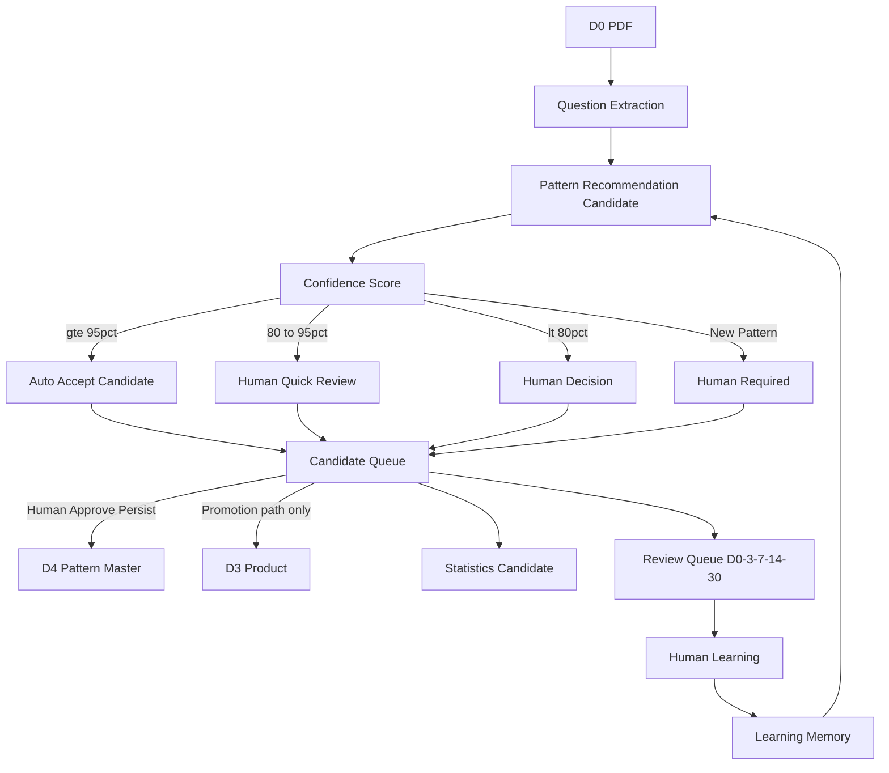

# Knowledge Extraction Mode — Execution Policy

Version 1.1 — 2026-07-22  
문서: `docs/agent/knowledge-extraction-mode.md`  
상태: **ADOPTED** (실행 중심 전환 · Constitution 아님)  
Active Top Sprint: **`KS-ACC-LOSSLESS-GOLDEN`** (`WO-20260722-006`) — 병합 없이 최우선  

> **이 문서는 Architecture / Constitution이 아니다.**  
> docs/35 · docs/37 · AI Exam OS(v1.0)를 **변경·대체하지 않는다.**  
> 운영체계(DevAgent OS · Exam Mode · AI Exam OS)는 유지하고,  
> **실행 중심(Execution Center)** 만 Knowledge Extraction으로 전환한다.

---

## 0. Mission Shift

| 이전 (비우선) | 이후 (최우선) |
|---------------|----------------|
| Platform Complete | **Knowledge Complete** |
| Feature Complete Sprint | **Pattern Complete** Knowledge Sprint |
| AI 플랫폼 완성 | **2027 감정평가사 1차 회계 점수 최대화** |

Platform은 목적이 아니다.  
Platform은 Knowledge를 학습하기 위한 **도구**이다.

---

## 1. Execution Hierarchy (운영 유지 · 실행만 추가)

```
docs/35          System Safety Constitution          [불변 · 최상위]
      ↓
docs/37          Exam Mode Constitution              [우선순위 · 미수정]
      ↓
AI Exam OS v1.0  docs/37 §9                          [운영 필드 · 유지]
      ↓
Knowledge Extraction Mode   ← 본 문서 (실행 중심)
      ↓
Learning (Human 학습 · Review)
      ↓
Platform (최소 UI · 도구)
```

**충돌 시:** docs/35 승 → docs/37 → AI Exam OS → 본 Mode.

---

## 2. Conflict Analysis (docs/35 · 37 · AI Exam OS)

| 주제 | 판정 | 정렬 규칙 |
|------|------|-----------|
| D4 Pattern Master Owner = Human | **정합 필요** | AI는 **Candidate**만 생성. Persist는 Human Approval / Gate. “95% Auto Accept” = **Candidate Auto-Accept** ≠ D4 SoT 무단 쓰기 |
| D3 Product = Promotion only | **정합 필요** | “Question DB 생성”은 Emit/Candidate/staging. Product Snapshot은 Promotion Gate + Human |
| Parser Core Freeze | **정합** | PDF→Question은 **기존 Parser Emit 경로 우선**. 본 Mode가 `scripts/parser/`를 우회·재발명하지 않음 |
| Path L (ADR-004 L1) | **정합** | exam_pipeline/repair로 D3 직접쓰기 금지 |
| Coach C4 Forbidden (Exam Mode) | **정합** | Knowledge Sprint ≠ C4. Planner 확장 금지 |
| Exam Impact Score / OS 필드 | **정합** | Knowledge WO도 OS 필수 필드 유지. Feature보다 Knowledge를 **우선 추천**만 변경 |
| AI = 조언자 (docs/35) | **정합** | Pattern 추천·Confidence는 조언. 최종 Pattern 판단은 Human |
| “Human이 JSON을 안 만든다” | **정합** | Human = 승인/수정/예외. AI = 초안·큐·통계 생성 |
| Truth Split | **위험 완화** | Knowledge 산출물은 Candidate/Review Queue에 두고 SoT와 분리 |

**결론:** 새 Architecture 없이 실행 가능. Authority 위반 소지는 “Auto Persist” 해석뿐 → 본 문서에서 **Candidate ≠ SoT Persist**로 고정.

---

## 3. Role Split

### Human

- Pattern **승인** / **수정** / **신규 Pattern 승인**
- 예외 상황 판단
- **학습** (시험 공부 Primary)

Human은 문제 입력·문서 작성·JSON 직접 작성·Pattern 초안 작성을 **기본 업무로 하지 않는다.**

### AI

```
PDF 분석 → Question 추출 → Pattern 후보 → Confidence
  → Pattern/Question/Statistics Candidate
  → Review Queue 생성
```

AI는 반복 작업. Human은 판단.

---

## 4. Knowledge Sprint Definition

| ID 예 | 목표 | DONE = Pattern Complete |
|-------|------|-------------------------|
| **KS-001** | 재고자산 Pattern Complete | ACC_INV_* 커버·분류·Confidence·Review 기준 충족 · **`KS-ACC-LOSSLESS-GOLDEN` 이후 권장** |
| **KS-ACC-LOSSLESS-GOLDEN** | 회계 Lossless Golden Question DB | **현재 최우선** · Charter: `docs/agent/knowledge-sprints/KS-ACC-LOSSLESS-GOLDEN.md` · WO-20260722-006 |
| **KS-002** | 유형자산 Pattern Complete | ACC_PPE_* … |
| **KS-003** | 금융자산 Pattern Complete | … |
| **KS-004** | 수익 Pattern Complete | … |
| … | 단원별 | Feature 개수가 아님 |

Sprint 이름 접두사: `KS-NNN` (Knowledge Sprint).  
기존 Feature WO(E8, MVP, Enhancement)는 **폐기하지 않음** · 우선순위만 하향.

---

## 5. Knowledge Extraction Pipeline

```
PDF (D0)
  ↓
Question Extraction     ← Parser Emit / 기존 산출 우선 (Plane A 재발명 금지)
  ↓
Pattern Recommendation  ← Candidate only
  ↓
Confidence Score
  ↓
Human Review            ← 규칙에 따라 생략·Quick·Required
  ↓
Pattern DB Update       ← D4: Human Approve 후 Persist
  ↓
Statistics Update       ← 파생 집계 (Authority 준수)
  ↓
Review Queue Update     ← 학습 복습 큐 (D7/Learner · Question body 미복제)
```

---

## 6. Confidence Workflow

| Confidence | 동작 |
|------------|------|
| **≥ 95%** | **Auto Accept Candidate** → Review Queue / Candidate store. **D4/D3 SoT 자동 쓰기 금지** (별도 Human/Gate 정책이 있을 때만 Persist) |
| **80–95%** | Human **Quick Review** |
| **&lt; 80%** | Human **Decision Required** |
| **New Pattern ID** | **Human Required** (항상) |

ADR-001 Option A 등 Signed Decision이 있으면, 해당 Pattern 등록 실행은 **기존 Gate A + D4-write** 경로를 따른다.

---

## 7. Learning Workflow (AI ← Human 판단)

1. Human이 Pattern을 수정·승인하면 **Learning Memory**에 기록 (판단 사건 · append-only 권장).  
2. 유사 Question에 대해 AI는 동일 Pattern을 **우선 추천**.  
3. AI는 기출 표면을 생성·수정하지 않는다 (docs/35).  
4. Learning Memory ≠ Question body 저장.

---

## 8. Review Queue Structure

Human이 수정한 문제(또는 Pattern 판결이 난 Question)는 Review Queue에 등록.

| Interval | 용도 |
|----------|------|
| 오늘 (D0) | 즉시 복습 |
| D+3 | 단기 |
| D+7 | 중기 |
| D+14 | 장기 |
| D+30 | 유지 |

스키마 초안 (구현 시 Gate A로 확정 · 키 rename 금지 원칙 준수):

```text
reviewQueueItem:
  questionId
  patternId
  reason: human_pattern_edit | low_confidence | new_pattern | ...
  schedule: [0, 3, 7, 14, 30]  # days
  status: pending | done | skipped
```

Question stem/choices/answer는 Queue에 **복제하지 않고** `questionId`만 참조.

---

## 9. Navigator Priority (변경점)

Exam Impact Score · AI Exam OS 필드는 **유지**.

Navigator 추천 순서:

| Priority | 유형 |
|----------|------|
| **1** | Knowledge Extraction |
| **2** | Knowledge Review |
| **3** | Minimal Learning UI |
| **4** | Platform Improvement |
| **5** | Commercial Feature |

Feature WO보다 **Knowledge WO를 항상 우선 추천**한다.  
최종 질문(AI Exam OS): 합격 확률을 높이는가? → YES / NO / UNCERTAIN.

Agent 사전 질문:

> “이 기능이 회계 **학습 효과**를 직접 높이는가?”  
> NO → 시험 후.

---

## 10. Success Criteria & Knowledge Metrics

더 이상 “기능 몇 개”를 주 지표로 쓰지 않는다.

| Metric | 의미 |
|--------|------|
| **Coverage** | 시험/단원 대비 Pattern·Question 커버 |
| **Accuracy** | 분류·Pattern 일치 (Human 판결 대비) |
| **Pattern Count** | 승인된 Pattern 수 |
| **Question Count** | 분류된 Question 수 |
| **Confidence** | 분포·평균·임계 미달 비율 |
| **Review Backlog** | Queue 적체 |
| **Weak Pattern** | 오답·저신뢰 집중 Pattern |
| **Exam Readiness** | 1차 회계 대비 준비도 종합 |
| **Pattern Complete %** | Knowledge Sprint DONE율 |
| **Question 분류율** | 추출 대비 분류 완료율 |
| **Review 완료율** | Queue 소화율 |
| **Exam Coverage** | 기출 연도·단원 커버 |

---

## 11. Migration Plan — Platform Dev → Knowledge Dev

| Phase | 내용 | 비고 |
|-------|------|------|
| **M0** | 본 정책 Adopt · Memory 기록 · Navigator 우선순위 전환 | 코드 불필요 |
| **M1** | Candidate/Review Queue **스키마·스토어 초안** WO (Persist Scope = Guardian) | D3/D4 직접쓰기 금지 |
| **M2** | KS-001 재고자산 Pattern Complete (기존 ACC_INV + gap) | Exam Impact 높음 |
| **M3** | Confidence + Learning Memory 루프 | Human 수정 → 재추천 |
| **M4** | 다음 단원 KS-002… | Pattern Complete 단위 |
| **Mx** | Minimal Learning UI only | Priority 3 |

**동결 유지:** SaaS · 결제 · UI polish · C4 · Architecture refactor · Commercial (docs/37 Forbidden / Priority 5).

**기존 Track:** `WO-20260722-004` D4 REGISTER 등은 폐기하지 않고 Knowledge Priority·Authority Gate로 **재평가**.

---

## 12. Knowledge Pipeline Diagram



---

## 13. WO Template Addendum (Knowledge)

기존 AI Exam OS 필드에 더해 Knowledge WO는 권장:

```text
wo_class: KNOWLEDGE_EXTRACTION | KNOWLEDGE_REVIEW | LEARNING_UI | PLATFORM | COMMERCIAL
knowledge_sprint_id: KS-001
pattern_complete_target: ACC_INV_*
```

Authority·Gate·forbidden_actions는 `docs/agent/orchestration-design.md` 그대로.

---

## 14. Adoption Log

| 항목 | 값 |
|------|-----|
| Adopted | 2026-07-22 |
| By | Project Owner / Navigator Package |
| docs/35 | untouched |
| docs/37 | untouched |
| AI Exam OS | untouched (우선순위 해석만 본 문서가 보완) |
| New Constitution | **none** |

---

**끝.**  
Knowledge Complete가 목표이고, Platform은 도구이며, 진실(Authority)은 여전히 docs/35에 있다.
