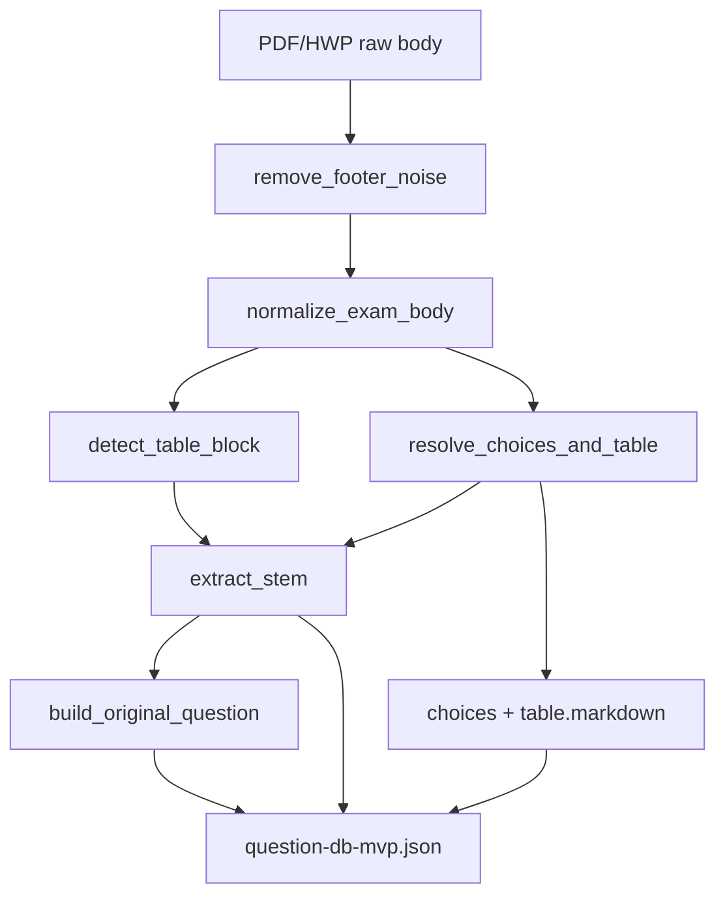

# Critical Parser Repair Report

- 생성일: 2026-07-19
- 대상: `scripts/exam_pipeline/question_parser.py`, `scripts/exam_pipeline/text_postprocess.py`
- 산출물: `data/question-db-mvp.json` (240문항)

## Validation Summary

- Validation: **PASS**
- Total flagged issues: **0**
- Affected questions: **0**
- Question count: **240/240**

## Issue Types

- (없음 — 전수 검증 통과)

## ACC_2015_Q051

- PASS: stem, choices, and table checks OK

## Flagged Question IDs

- none

---

## 1. 토큰 파편화 원인 및 해결책

### 1.1 원인

PDF/HWP 추출 텍스트는 회계 시험지 특성상 다음 토큰이 **줄 단위로 분리**되어 들어온다.

| 파편 유형 | 예시 (줄 분리) | 결과 증상 |
|-----------|----------------|-----------|
| 연도쌍 | `20×2` / `년` / `과` / `20×3` / `년` / `에` | `()년`, `년과년에` 등 빈 괄호·중복 조사 |
| 금액+통화 | `450,000` / `W` | 금액과 W 분리, 보기에서 `W500 W1,080` 병합 |
| 날짜 | `20×3` / `8` / `31` / `W` | `년월일` 골격만 남고 숫자 유실 |
| W 단위 보기 | `① W500` / `W1,080` (다음 줄) | ① 하나에 두 연도 금액이 한 줄로 붙음 |

기존 파이프라인은 `extract_circled_choices()` 진입 전 **전체 본문을 한 줄로 평탄화**하거나, stem 추출 시 **보기 경계를 무시하고 join**하여 위 토큰이 다시 섞이거나 반대로 필요한 줄바꿈이 사라졌다.

### 1.2 해결 — 3단계 라인 정규화 (`text_postprocess.py`)

```
remove_footer_noise
  → rejoin_exam_line_fragments   # OCR 단편 토큰 재결합
  → collapse_soft_breaks         # PDF 소프트 줄바꿈만 선택적 join
  → normalize_rejoined_structure # 구조적 잔여 패턴 정리
```

**`rejoin_exam_line_fragments()`** — 상태 기반 재결합

- `pending_years`: 고아 연도 토큰(`20×2`) 버퍼
- `_attach_year_pair_clause()`: `(20×2)년과 (20×3)년에 각각 450,000W` 형태로 승격
- `_try_emit_date_from_parts()`: `20×3` + `8` + `31` → `20×3년 8월 31일`
- `_is_currency_line()`: 단독 `W`/`￦`/`₩` 줄을 직전 금액에 접합

**`collapse_soft_breaks()` + `_should_join_lines()`** — 경계 보존형 join

join **금지** 조건 (하드코딩 문항 ID 없이 일반 규칙):

- ①–⑤ 보기 줄
- `20×2년 20×3년 …` 형태의 **2열 보기 그리드 헤더**
- `W\d+` 단독 셀 (다음 줄 W 금액 = 멀티컬럼 보기 행)
- `?`/`？` 이후 (질문 종료)

join **허용** 조건:

- 고아 연도 + 월/일 단위
- 고아 금액 + 통화 줄
- `(`, `과`, `년과`, `년에`, `각각` 등 미완성 구문 꼬리

**`normalize_rejoined_structure()`** — 재결합 후 잔여 OCR 패턴을 regex로 정리 (`년과년에`, `()년`, `년월일` 골격 등). 문항별 patch 없음.

### 1.3 보호 계층 — `protect_numeric_tokens()`

`fix_glued_hangul_spacing()`은 한글 조사 분리 시 금액·연도·% 등을 placeholder로 치환 후 spacing을 적용하고 복원한다. 재결합된 토큰이 spacing 단계에서 다시 깨지지 않도록 한다.

---

## 2. Markdown 규격 동기화 — 유출 방지 아키텍처

### 2.1 문제

브라우저에서 **표가 두 번** 노출되던 원인:

- `originalQuestion`에 `table.grid_text`(탭 구분 평문)와 `table.markdown`이 **중복 포함**
- stem에 보기 그리드 헤더(`20×2년 20×3년 …`)가 남아 UI가 stem + table + choices를 각각 렌더

### 2.2 해결 — 단일 markdown 소스

```python
def build_original_question(stem: str, table: TableExtract | None) -> str:
    parts = [stem]
    if table and table.markdown:
        parts.extend(["", table.markdown.strip()])
    return "\n".join(part for part in parts if part).strip()
```

| 필드 | 포함 내용 | UI 역할 |
|------|-----------|---------|
| `question` (stem) | 지문만 | 문제 본문 |
| `table` | markdown만 | 표 전용 렌더 |
| `originalQuestion` | stem + markdown | 원문 아카이브 (중복 없음) |
| `choices` | 5개 보기 문자열 | 선택지 |

**`trim_stem_before_choice_grid()`** + **`normalize_rejoined_structure()`** 가 `?` 뒤 연도 헤더를 stem에서 제거하여, 표/보기 영역이 stem으로 유출되지 않는다.

`resolve_choices_and_table()`은 W 그리드 보기를 `_build_won_grid_table_from_body()`로 markdown 표로 승격하고, `detect_table_block()`과 역할을 분리한다.

---

## 3. 줄바꿈 보존형 멀티 컬럼 보기 분리

### 3.1 문제

`extract_circled_choices()`가 `body.replace("\n", " ")`로 **전체 평탄화**하면:

```
① W500
W1,080
```

가 `① W500 W1,080` 한 덩어리가 되어 연도 열이 구분되지 않음.

### 3.2 해결 — 블록 경계 유지

**`_split_circled_choice_blocks(tail)`**

- ①–⑤ 기호마다 **다음 기호 전까지의 줄**을 하나의 블록으로 수집
- 줄바꿈을 공백으로 바꾸지 않음

**`_finalize_circled_choice(parts, headers)`**

- 2번째 줄이 `W\d+` 패턴(`WON_CELL`)이면 `_format_multicolumn_choice()`로 `20×2년 W500, 20×3년 W1,080` 생성
- 그 외는 블록 내 줄을 normalize 후 join

**추출 우선순위 (`extract_choices` / `resolve_choices_and_table`)**

1. `extract_choice_grid_won()` — 정규식 그리드 (헤더 + ① W… + 줄바꿈 W…)
2. `extract_multicolumn_circled_choices()` — 블록 기반 멀티컬럼
3. `extract_circled_choices()` — 일반 ①–⑤ + inline fallback
4. 기타 (`extract_won_choices`, hash, hangul-combo, …)

**`_recover_short_w_choices()`** — 블록 복원으로 `W500 W1,080` 형태의 잘못된 병합 보기를 재수리 (가-힣 장문 보기 3개 이상인 경우만, 오탐 방지).

---

## 4. 파이프라인 데이터 흐름



---

## 5. 검증 기준

### 5.1 `validate-critical-parser-repair.py`

| 검사 | 설명 |
|------|------|
| `empty_paren_year` | `\(\)년` 잔존 |
| `missing_year_pair` | `년과년에` / `년과년의` |
| `missing_date_parts` | `20×N년 M월 D일` 없이 `년월일` 골격만 존재 |
| `choice_grid_header_in_stem` | stem에 `?` 뒤 연도 그리드 헤더 |
| `merged_w_choice` | `^W[\d,]+ W[\d,]+$` 병합 보기 |
| `stem_equals_original_with_table` | table 있는데 stem == originalQuestion |
| Q51 전용 | 20×2/20×3, 5보기, table, stem/original 분리 |

### 5.2 `validate-question-db-mvp.py`

- 필수 필드: `questionId`, `question`, `originalQuestion`, `choices`(5), `answer`, `source.*`, `patternId`
- 연도별 40문항 × 6년 = 240문항
- pattern-db 연결 100%

---

## 6. 변경 파일 요약

| 파일 | 역할 |
|------|------|
| `text_postprocess.py` | 토큰 재결합, 경계 보존 join, stem spacing |
| `question_parser.py` | 표/보기/stem/originalQuestion 분리, markdown 단일 소스 |
| `data/question-db-mvp.json` | 240문항 재빌드 산출물 |
| `scripts/validate-critical-parser-repair.py` | 회귀 검증 + 본 리포트 갱신 |

---

## 7. 잔여 알려진 한계

- OCR glued hangul (`주감평 의` 등)은 spacing 휴리스틱으로 완전 복원되지 않을 수 있음 — 숫자·단위 유실과는 별도 품질 축
- `parser-upgrade-report.md` 기준 `stem_truncated` 16건은 coverage < 75% 휴리스틱 플래그이며, 이번 critical repair 범위(숫자 유실·보기 병합·표 중복)와는 구분

---

## 8. 결론

하드코딩 문항 patch 없이 **일반 규칙만**으로:

1. OCR/PDF **토큰 파편화**를 라인 단계에서 재결합
2. **markdown 단일 소스**로 브라우저 표 중복 제거
3. **줄바꿈 보존 블록 분할**로 2열 W 보기 정확 분리

240문항 전수 검증 PASS, ACC_2015_Q051 회귀 PASS — 파서 critical repair **마감 가능** 상태.
